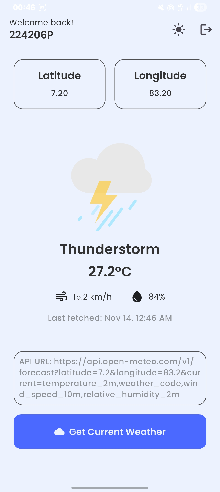
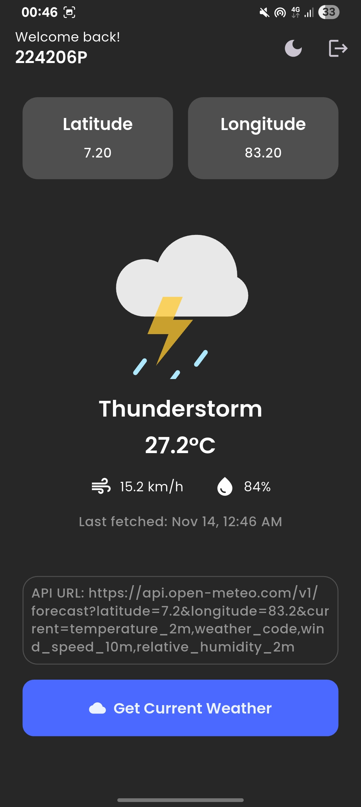

# 🌦️ Flutter Weather App
A simple and modern Flutter weather application that fetches real-time weather data using the **Open-Meteo API**.  
The app supports **dark/light mode**, **offline detection**, **persistent login using SharedPreferences**, and displays **weather information** such as temperature, humidity, and wind speed.

## 🚀 Features

✅ **Weather Fetching**  
- Fetches live weather data (temperature, humidity, wind speed, weather condition) from the [Open-Meteo API](https://open-meteo.com/).  
- Calculates latitude and longitude automatically based on the user’s index number.

✅ **Persistent Login**  
- Uses `SharedPreferences` to store the user’s index number and last fetched weather data.

✅ **Dark / Light Theme**  
- Dynamically toggled using the `Provider` package (`ThemeProvider`).

✅ **Offline Detection**  
- Uses `connectivity_plus` to check network connectivity.  
- Shows a red MaterialBanner when offline.  
- Prevents API calls when disconnected.

✅ **Error Handling**  
- Displays friendly “Error fetching weather” message on failures.  
- Prevents crashes when offline or data is missing.

✅ **Clean UI**  
- Uses modern UI styling with **Google Fonts (Poppins)** for text.  
- Displays weather info in neat info cards.

---

## 🧠 How It Works

1. On first launch, the user enters their **index number**.  
2. The app calculates:

   ```dart
   latitude = 5 + (firstTwoDigits / 10);
   longitude = 79 + (nextTwoDigits / 10);
   ```

3. Fetches data from the Open-Meteo API:

   ```
   https://api.open-meteo.com/v1/forecast?latitude={lat}&longitude={lon}&current=temperature_2m,weather_code,wind_speed_10m,relative_humidity_2m
   ```

4. Saves the data locally using `SharedPreferences` for offline viewing.

5. Provides a refresh button to get updated data instantly.


## 🏗️ Project Structure

  ```
lib/
│
├── main.dart
│
├── screens/
│   ├── home/
│   │   ├── home_screen.dart
│   │   ├── utils/
│   │   │   ├── weather_model.dart
│   │   │   ├── weather_widgets.dart
│   │
│   ├── welcome_input_screen.dart
│
├── utils/
│   ├── theme_provider.dart
│   ├── custom_themes.dart
│
└── ...
```

---

## 📦 Packages Used

| Package                 | Purpose                                    |
| ----------------------- | ------------------------------------------ |
| `http`                  | Fetch data from Open-Meteo API             |
| `provider`              | Manage app theme state                     |
| `shared_preferences`    | Save index number and weather data locally |
| `connectivity_plus`     | Detect offline/online status               |
| `google_fonts`          | Use custom fonts (Poppins)                 |
| `flutter/material.dart` | Core Flutter UI components                 |


---

## ⚙️ Setup & Installation

### 1️⃣ Clone the project

```bash
git clone https://github.com/yourusername/flutter-weather-app.git
cd flutter-weather-app
```

### 2️⃣ Install dependencies

```bash
flutter pub get
```

### 3️⃣ Run the app (in debug mode)

```bash
flutter run
```

### 4️⃣ Build release APK

```bash
flutter build apk --release
```

You can find the APK at:

```
build/app/outputs/flutter-apk/app-release.apk
```

---

## 💻 Beginner Setup Guide (VS Code + Device)

### ✅ Requirements

* [Flutter SDK](https://docs.flutter.dev/get-started/install) installed
* Android Studio or VS Code with Flutter extension
* USB debugging enabled on your phone
* Android SDK tools installed

### 🔹 Run on Android Device (VS Code)

1. Connect your Android phone via USB
2. Enable **Developer Mode → USB Debugging**
3. Open VS Code and click **Run → Start Debugging (F5)**
4. Select your device from the list
5. Wait for the app to install and launch automatically

### 🔹 Install Manually via APK

1. Build the release version:

   ```bash
   flutter build apk --release
   ```
2. Copy `app-release.apk` to your phone.
3. Open the file and install manually.

---

## 🖼️ Screenshots

| Light Mode                                       | Dark Mode                                      |
| ------------------------------------------------ | ---------------------------------------------- |
|  |  |

---

## 🪄 Future Improvements

* 🌍 Add location picker for latitude & longitude
* ☁️ Display weather icons dynamically
* 🕒 Add caching duration (e.g., refresh every 30 minutes)
* 📅 Include 7-day weather forecast

---

## 🪶 License

This project is open-source and available under the **MIT License**.

---

### ⭐ If you like this project, please consider giving it a star on GitHub!

---
